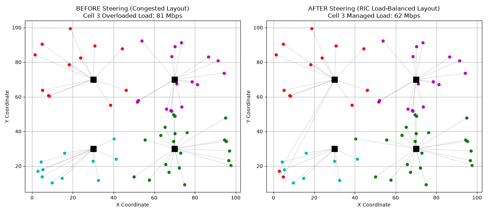
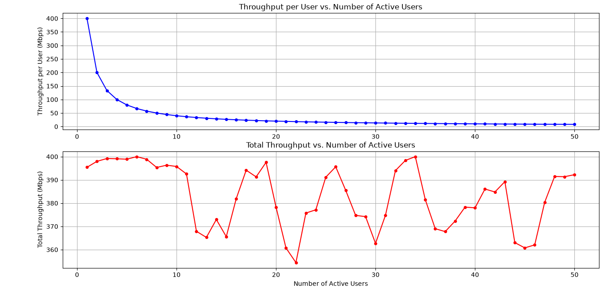

# Traffic Steering in 5G using ORAN

An execution framework designed to simulate, visualize, and analyze intelligent **Traffic Steering** algorithms within an open and virtualized **5G Radio Access Network (Open RAN)** topology.

---

## 📖 System Operational Design

The simulation script architectures a spatial topology network to map out two core deployment execution paradigms controlled by an optimized **Near-Real-Time RAN Intelligent Controller (Near-RT RIC)**:

### Scenario A: BEFORE Steering (Unoptimized Shortest-Path Mode)
* **Logic:** User Equipment (UE) devices hook blindly to base stations (`gNB Nodes`) based solely on spatial closeness (Minimum Euclidean Distance Path).
* **Bottleneck:** Because spatial demand density is concentrated unevenly, **Cell 3 suffers a severe traffic overload bottleneck**, while adjacent base stations remain heavily underutilized. This state introduces extreme queue delay latency and threatens Quality of Service (QoS) drop bounds.

### Scenario B: AFTER Steering (Open RAN Load-Balanced Mode)
* **Logic:** An optimization loop mimicking a micro-service framework (**xApp**) running on the Near-RT RIC actively samples queue load levels. 
* **Mitigation:** When Cell 3 breaches its `capacity_threshold` (120 Mbps), the engine intercepts boundary connection states and seamlessly **steers 33% of the congested user paths** to the next-best available neighbor base station runner-up, balancing the entire network grid.

### 📊 Network Simulation Visualizations
Below are the side-by-side geographic network deployment graphs generated by the optimization engine:

#### Before vs. After Traffic Steering Mapping Matrix


* **Left Panel:** Illustrates the proximity-based loading model where Cell 3 handles massive load overhead.
* **Right Panel:** Visualizes the automated load-balancing scheme managed by the Near-RT RIC application loop.

---

## 📊 Dynamic Metrics Calculated

Rather than utilizing static values, all log analytics generated in the console stream are evaluated live based on the running network layout matrices:
* **Average Latency:** Derived dynamically per-user based on connection distance vectors (propagation time) plus base station loading volumes (queuing delay overhead).
* **Total Power Usage:** Calculated live via a fixed baseline power configuration (15.0 Watts per cell site) aggregated with a variable traffic load coefficient (0.12 Watts per processed Mbps).
* **User Scalability Analysis:** Computes finite cell bandwidth splitting arrays to model exponential data-rate decay per user alongside dynamic system capacity variations under device density stress tests.

#### 📈 Throughput & Capacity Analytics Plot


---

## 🛠️ Execution Instructions

### Prerequisites
The script runs completely on standard, lightweight Python scientific computation toolkits. It supports environment paths from Python 3.11 up to Python 3.14 without requiring heavy engine dependencies like TensorFlow:

```bash
pip install numpy matplotlib
```

### Running the Simulator
To train the allocation matrices, trace connection paths, and trigger visual plotting windows, execute the script via your workspace terminal launcher:
```bash
python oran5g.py
```
